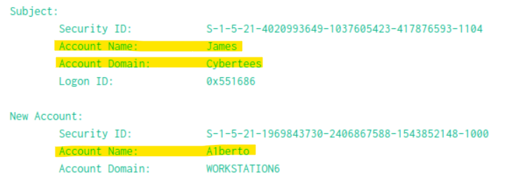
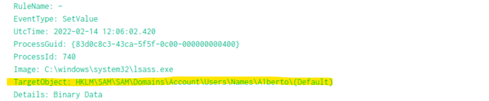
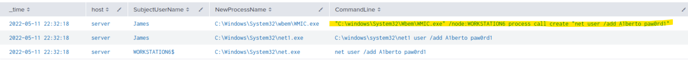
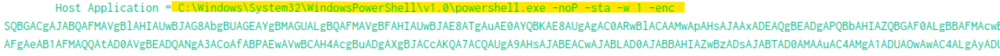

# Investigating with Splunk

## Overview

In this lab I used Splunk to investigate suspicious activity on several Windows hosts.

During the investigation I found a new suspicious user, registry changes, remote command execution and malicious PowerShell activity.

I also analyzed an encoded PowerShell command and found a URL that was contacted by the infected machine.

## New User Creation

I started by looking for newly created users.

Windows Event ID 4720 is generated when a new user account is created.

```spl
index=main EventCode=4720
```

I found a new user called:

```text
A1berto
```

From the event I could also see that the account was created by the user `James`.




Some important information from the event:

```text
New user: A1berto
Created by: James
Target: WORKSTATION6
Event ID: 4720
```

The name `A1berto` looked suspicious because the number `1` was used instead of the letter `l`.

This made me think that the attacker might be trying to make the account look like another real user.

## Registry Change

After finding the new user I checked if there were registry changes on the same host.

Sysmon Event ID 13 records registry value changes.

I searched for Event ID 13 on the host.

```spl
index=main EventID=13 Hostname="Micheal.Beaven"
```

The search returned 10 events.

To make the search more specific I added the username that I found earlier.

```spl
index=main EventID=13 Hostname="Micheal.Beaven" "A1berto"
```

This helped me find the registry change related to the new account.



Registry path:

```text
	HKLM\SAM\SAM\Domains\Account\Users\Names\A1berto
```

This registry event was related to the newly created A1berto account.


## Finding the User Being Impersonated

The username `A1berto` uses the number `1` instead of the letter `l`.

Because of this I searched for a user called `alberto`.

```spl
index=main "alberto"
```

The search showed that `alberto` was a real user in the environment.

The two usernames were very similar.

```text
Real user:      alberto
Backdoor user:  A1berto
```

This looks like an attempt to make the malicious account look like a legitimate account.

## Finding How the User Was Created

Next I wanted to find how the attacker created `A1berto`.

I searched Event ID 4688 which records process creation.

```spl
EventID=4688 "A1berto"
| table _time host SubjectUserName NewProcessName CommandLine
| sort _time
```

The results showed three related processes.

One of them contained this command:

```text
WMIC.exe /node:WORKSTATION6 process call create "net user /add A1berto [REDACTED]"
```




The important part was:

```text
/node:WORKSTATION6
```

This showed that WMIC was being used to run the command on another computer.

I also found `net.exe` and `net1.exe` processes that were used to create the account on `WORKSTATION6`.

The activity looked like this:

```text
WMIC
  |
  v
WORKSTATION6
  |
  v
net.exe
  |
  v
A1berto created
```

This showed that the attacker used WMIC to remotely create the backdoor user.


## Login Attempts

After finding the backdoor account I checked if it was used for login attempts.

The main Windows events I looked for were:

```text
4624 - Successful login
4625 - Failed login
```

I searched for both events related to `A1berto`.

```spl
index=main "A1berto" (EventID=4624 OR EventID=4625)
| table _time EventID TargetUserName IpAddress LogonType
| sort _time
```

I also used `stats` to count the events.

```spl
index=main "A1berto" (EventID=4624 OR EventID=4625)
| stats count by EventID
```

Number of login attempts found:

```text
0
```

## Suspicious PowerShell Activity

Later in the investigation I found suspicious PowerShell activity.

The infected host was:

```
James.browne
```

PowerShell logging was enabled on the host, so I searched for Event IDs 4103 and 4104.

```
index=main Hostname="James.browne" (EventID=4103 OR EventID=4104)
```


Within the investigation time range, the search returned 79 PowerShell events.

One of the PowerShell commands contained:

```
powershell.exe -noP -sta -w 1 -enc ...
```




The `-enc` parameter means that the PowerShell command was encoded.

Because the command was encoded, I could not immediately see what it was doing. The next step was to decode the command and analyze its content.


## Decoding the PowerShell Command

The PowerShell command contained a long Base64 string after the `-enc` parameter.

I copied the encoded value and decoded it.

PowerShell EncodedCommand uses UTF-16LE encoding, so after decoding the Base64 data I was able to read the PowerShell script.

Inside the decoded script I found a WebClient being created.

```powershell
New-Object System.Net.WebClient
```

I also found another Base64 encoded value inside the script.

After decoding it I found the server address:

```text
http://10.10.10.5
```

Another variable in the script contained:

```text
/news.php
```

The script combined both values before making the request.

```text
http://10.10.10.5 + /news.php
```

The full URL was:

```text
http://10.10.10.5/news.php
```

## Attack Chain

After going through the logs I was able to connect the different events.

|Activity|Evidence|
|---|---|
|New user created|Event ID 4720|
|Backdoor user identified as A1berto|Account creation event|
|Registry changed|Sysmon Event ID 13|
|Remote command execution|Event ID 4688|
|WMIC used against WORKSTATION6|CommandLine|
|Backdoor account created with net.exe|Process creation|
|Suspicious PowerShell activity | Event IDs 4103 and 4104
|Web request found|PowerShell script|
|Full URL identified|[http://10.10.10.5/news.php](http://10.10.10.5/news.php)|

## Indicators Found

|Type|Value|
|---|---|
|Backdoor user|A1berto|
|Real user|alberto|
|Target host|WORKSTATION6|
|Infected PowerShell host|James.browne|
|Remote execution tool|WMIC.exe|
|Account creation tool|net.exe|
|PowerShell process|powershell.exe|
|Remote IP|10.10.10.5|
|URL|[http://10.10.10.5/news.php](http://10.10.10.5/news.php)|
|Registry path| HKLM\SAM\SAM\Domains\Account\Users\Names\A1berto|

## MITRE ATT&CK

Some of the activity found in the investigation can be connected to MITRE ATT&CK techniques.

|Activity|Technique|
|---|---|
|Backdoor account creation|Create Account|
|A1berto look-alike username|Masquerading|
|WMIC execution|Windows Management Instrumentation|
|PowerShell execution|PowerShell|
|Encoded PowerShell|Obfuscated Files or Information|

## Hunting and Detection Ideas

After finishing the investigation I also looked at how some of this activity could be detected in Splunk.

### New User Creation

```spl
index=main EventCode=4720
| table _time host SubjectUserName TargetUserName
```

### Remote WMIC Execution

```spl
index=main EventID=4688
CommandLine="*/node:*"
| table _time host SubjectUserName NewProcessName CommandLine
```

### Encoded PowerShell

```spl
index=main EventID=4688
NewProcessName="*powershell.exe"
(CommandLine="*-enc *" OR CommandLine="*-EncodedCommand*")
| table _time host SubjectUserName CommandLine
```

## Conclusion

During this investigation I used Splunk to follow suspicious activity across multiple Windows logs.

I started with a newly created account called `A1berto` and found that its name was very similar to the legitimate user `alberto`.

I then found registry activity related to the account and process creation logs showing that WMIC was used to remotely execute `net user` on `WORKSTATION6`.

Later I found suspicious encoded PowerShell activity on `James.browne`. By checking the PowerShell logs and decoding the command I found that the script made a request to:

```text
http://10.10.10.5/news.php
```

The main thing I learned from this investigation was how to use information from one event to continue the investigation. Instead of looking at each log separately, I used usernames, hosts, event IDs, timestamps and command lines to connect the activity and understand what happened.
